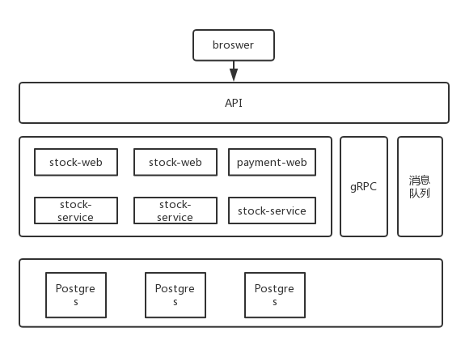

# Go-Secbuy-Micro
基于Go-micro微服务的秒杀系统

[系统说明](https://darkreunion.tech/2019/09/seckill-backend-system-base-on-go-micro/)

## 系统架构
一个经典的秒杀场景可以分为如下几个步骤
1. 创建商品的库存信息
2. 检查库存数量，满足数量就扣库存，否则失败
3. 成功扣取库存后创建订单
4. 创建支付记录

依据这个流程，系统分为如下几个服务
- 库存 stock
- 订单 order
- 支付 payment

系统架构：




## 环境准备

### Go和Go-Micro
- [Golang环境](https://golang.google.cn/)

Micro开发框架和工具
```
## 安装go-micro
go get github.com/micro/go-micro

## 安装micro
go get github.com/micro/micro
```

### protoc
- [protoc compiler](https://github.com/google/protobuf/releases)

安装好protoc编译器后还需要安装micro服务对应的生成插件。
```
go get -u github.com/micro/protoc-gen-micro
go get -u github.com/micro/protobuf/protoc-gen-go
```

### Postgres
可以通过docker快速启动一个Postgres实例。
```
docker run --name postgres-dev -d --restart=always -p 5432:5432 -e POSTGRES_PASSWORD=postgres123 postgres:11
```

可同时启动了一个adminer服务方便管理。
```
docker run --name adminer -d --restart=always -p 10080:8080 adminer
```

创建一个dev用户和secbuy数据库。
```
su potgres
createuser -P -e dev
psql -U postgres
CREATE DATABASE secbuy OWNER dev;
GRANT ALL PRIVILEGES ON DATABASE secbuy to dev;
```
